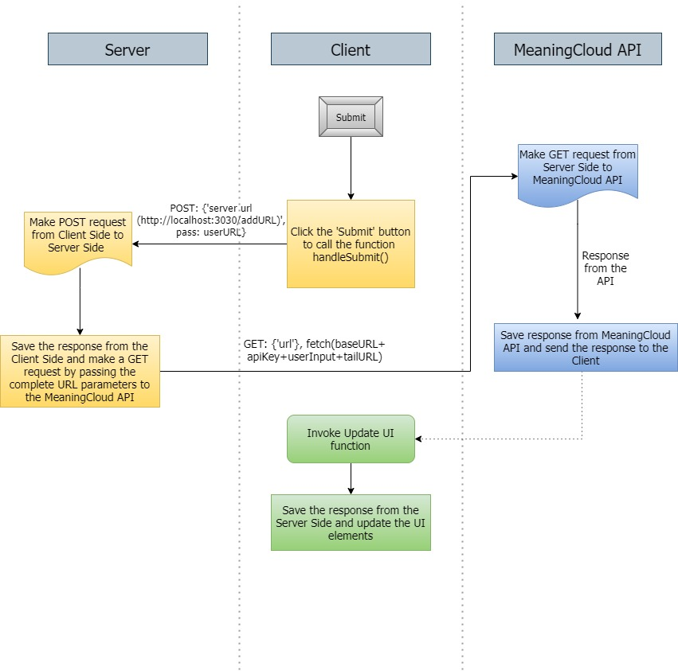

# Evaluate A News Article with Natural Language Processing


## About the Project
The goal of this project is to build a web tool that allows users to run Natural Language Processing (NLP) on articles or blogs found on other websites. NLP is the ability of an application to understand the human language, written or oral.

The motive of this project is to have a taste of the environment and tools you will most likely come across in a front end role. 

## Introduction to Natural Language Processing

Natural language processing (NLP) is a subset of AI that provides computers ability to process or interact with natural human speech. In NLP, machine learning and deep learning are used on massive amounts of data to obtain the rules and understanding of nuance in human speech. NLP is a subfield of linguistics, computer science, and artificial intelligence concerned with the interactions between computers and human language, in particular how to program computers to process and analyze large amounts of natural language data.

## MeaningCloud API

We will make use of an external API called MeaningCloud to interact with their NLP system. This tool will help us classify the information available in the article, like whether the content is subjective (opinion) or objective (fact-based) and whether it is positive, neutral, or negative in tone. MeaningCloud has put a public-facing API in front of their NLP system. We will use it in our project to determine various attributes of an article or blog post.

## Project Requirements

* Webserver - Node
* Web application framework for routing - Express
* Build tool - Webpack. Using webpack, we will set up the app to have dev and prod environments, each with their own set of tools and commands.
* External script - Service Worker
* External API - MeaningCloud

## Client-Server-API Architecture



## Get Up and Running

### Installation
Make sure Node and npm are installed from the terminal.
```
node -v
npm -v
```

1. Getting Started - Setting up the Project
```
cd <project directory>
git clone <repo>
git checkout branch 2-fixing-js
npm install
```

2. Install loaders and plugins
```
# Choose the necessary installation for your development mode
npm i -D @babel/core @babel/preset-env babel-loader
npm i -D style-loader node-sass css-loader sass-loader
npm i -D clean-webpack-plugin
npm i -D html-webpack-plugin
npm i -D mini-css-extract-plugin
npm i -D optimize-css-assets-webpack-plugin terser-webpack-plugin
```
3. Sign up for an API key at [meaningcloud.com](https://www.meaningcloud.com/developer/create-account)

4. Configure environment variables using dotenv package
	i. Install the dotenv package
	```
	npm install dotenv
	```
	ii. Create a new `.env` file in the root of your project
	iii. Fill the `.env` file with your API key like this:
	```
	API_KEY=**************************
	```
5. Start the project

Command | Action
:------------: | :-------------:
`npm run build-prod` | Build project
`npm start` | Run project

6. Open browser at http://localhost:3030/

## Credits
[Front End Web Developer Nanodegree](https://www.udacity.com/course/front-end-web-developer-nanodegree--nd0011)
#### ***This project is a graduation requirement for Udacity's Front End Web Developer Nanodegree.***
